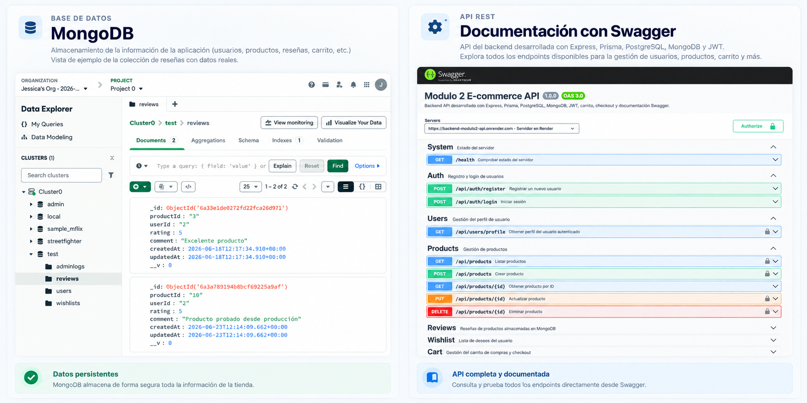
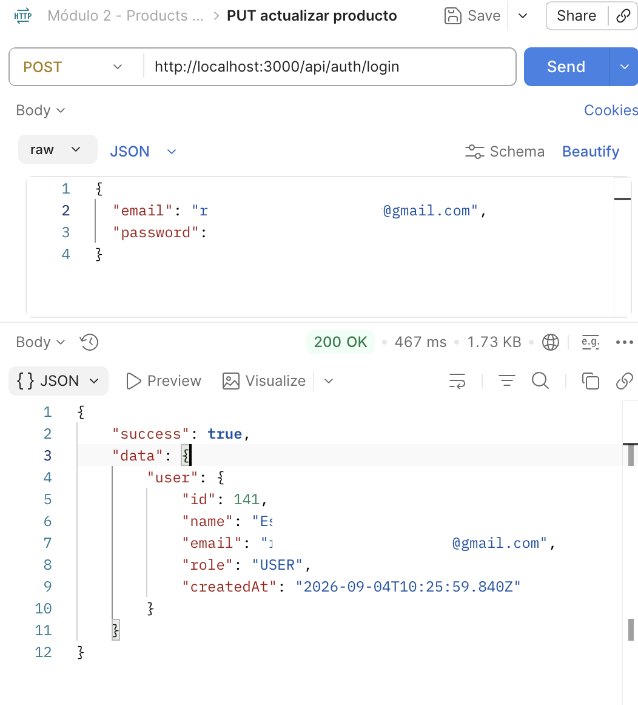
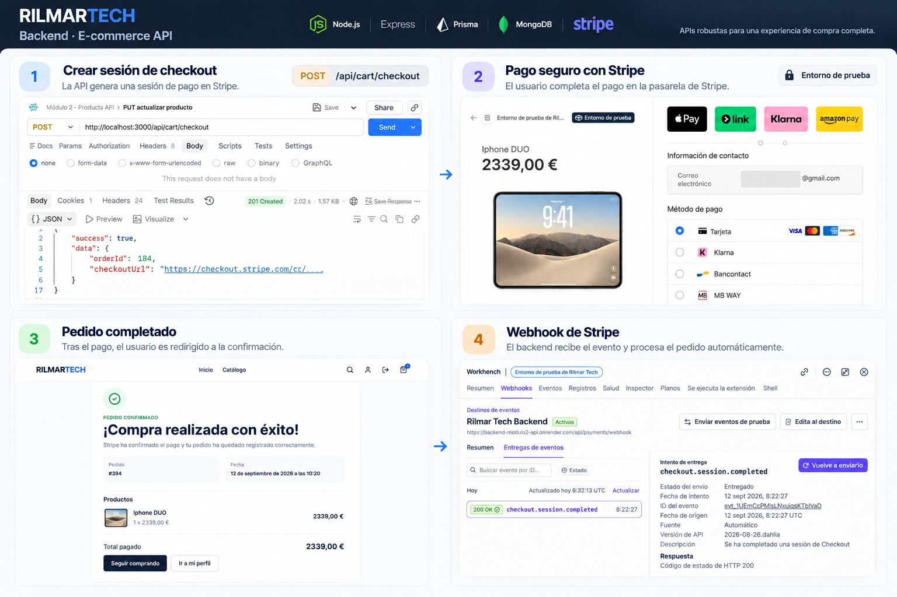
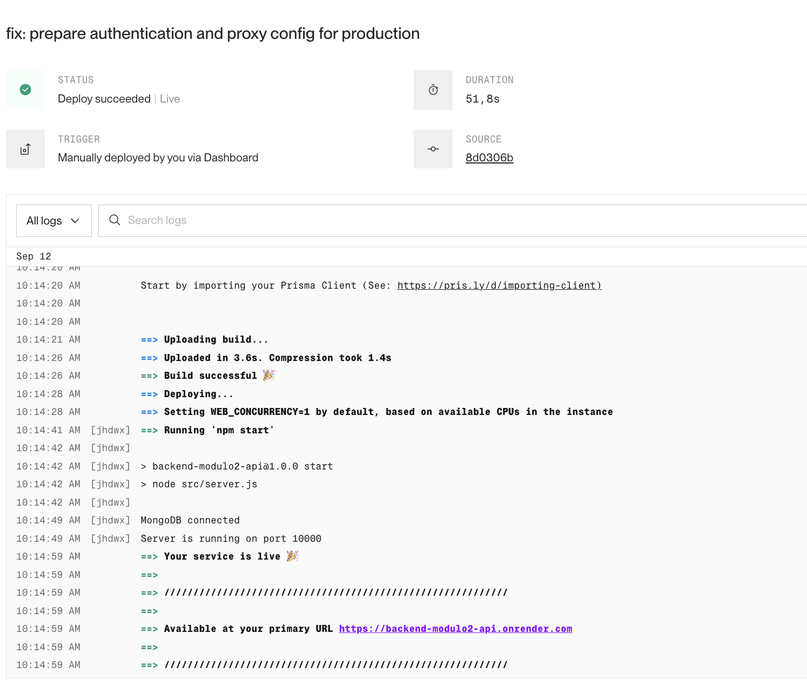

# Rilmar Tech — Backend API

Backend de una aplicación **full-stack de comercio electrónico** orientada a productos tecnológicos.

Autenticación segura · Catálogo · Carrito · Wishlist · Stripe · Pedidos · Administración · Emails · PostgreSQL · MongoDB

[Frontend](https://aesthetic-halva-6e8e80.netlify.app) ·
[API](https://backend-modulo2-api.onrender.com) ·
[Swagger](https://backend-modulo2-api.onrender.com/api/docs) ·
[Repositorio Frontend](https://github.com/J-Mateo/rilmar-tech-frontend)


---

## Vista general

Rilmar Tech separa frontend y backend en despliegues independientes. El backend concentra la lógica de negocio, autenticación, validación de stock, persistencia, pagos, emails transaccionales y autorización administrativa.

### Stack principal

| Área | Tecnologías |
|---|---|
| Runtime / API | Node.js, Express 5, JavaScript ES Modules |
| SQL | PostgreSQL, Prisma ORM |
| NoSQL | MongoDB Atlas, Mongoose |
| Auth / seguridad | JWT, cookies HTTP-Only, bcrypt, Helmet, CORS, rate limiting |
| Pagos | Stripe Checkout + webhooks firmados |
| Media | Cloudinary |
| Email | Resend |
| Testing | Jest, Supertest |
| Documentación | Swagger / OpenAPI |
| Deploy | Render + Netlify |

> El backend está desplegado en Render. En una instancia gratuita, el primer acceso después de un periodo de inactividad puede tardar unos segundos mientras el servicio se reactiva.

---

## Arquitectura

```text
HTTP Request
     │
     ▼
   Route
     │
     ▼
 Middleware
     │
     ▼
 Controller
     │
     ▼
  Service
     │
     ▼
Database / External service
```

```text
src/
├── controllers/
├── middleware/
├── routes/
├── services/
├── utils/
└── server.js

prisma/
├── migrations/
└── schema.prisma

tests/
```

Los controladores gestionan la capa HTTP y la lógica de negocio se concentra en servicios reutilizables.

---

## Persistencia híbrida

### PostgreSQL + Prisma

Se utiliza para información relacional y transaccional:

- Usuarios
- Productos
- Carritos
- Items del carrito
- Pedidos
- Items de pedidos
- Stock
- Estados comerciales
- Alertas de reposición

### MongoDB Atlas + Mongoose

Se utiliza para dominios documentales:

- Wishlist
- Reviews

Esta separación mantiene en PostgreSQL la integridad de las operaciones comerciales y utiliza MongoDB para información más documental.

---

## Autenticación y seguridad

La API utiliza JWT almacenado en una **cookie HTTP-Only**. El token no se devuelve en el JSON ni se almacena en `localStorage`.

```text
Registro / Login
       │
       ▼
Credenciales validadas
       │
       ▼
JWT firmado
       │
       ▼
Cookie HTTP-Only
       │
       ▼
Middleware de autenticación
```

Roles soportados:

```text
USER
ADMIN
```

Las operaciones administrativas se protegen también en backend.

### Contraseñas

Requisitos mínimos:

- 8 caracteres
- Una minúscula
- Una mayúscula
- Un número
- Un carácter especial

Las contraseñas se almacenan con **bcrypt**.

### Recuperación de contraseña

El flujo evita enumeración de usuarios y utiliza tokens temporales de un solo uso:

1. Se genera un token criptográficamente aleatorio.
2. El token real solo viaja en el enlace enviado por email.
3. En PostgreSQL se almacena únicamente su hash SHA-256.
4. Expira después de 15 minutos.
5. Una nueva solicitud invalida el token anterior.
6. Al restablecer la contraseña se incrementa `authVersion` y las sesiones anteriores dejan de ser válidas.

### Rate limiting

| Operación | Límite |
|---|---:|
| Login | 10 intentos / 15 min |
| Registro | 10 intentos / hora |
| Forgot password | 5 solicitudes / 15 min |
| Reset password | 10 intentos / 15 min |

---

## Catálogo y productos

La API permite:

- Consultar productos activos
- Buscar por texto
- Filtrar por categoría
- Filtrar por precio
- Filtrar por disponibilidad
- Ordenar resultados
- Paginar resultados
- Obtener el detalle de un producto

La búsqueda es **insensible a acentos** mediante la extensión `unaccent` de PostgreSQL.

```text
lampara → Lámpara Inteligente
```

### Administración de productos

Los usuarios `ADMIN` pueden:

- Crear productos
- Editar productos
- Gestionar stock
- Gestionar múltiples imágenes
- Desactivar productos
- Restaurar productos
- Buscar y filtrar catálogo administrativo

La eliminación es lógica:

```text
isActive = false
```

Las imágenes se suben con Multer y se almacenan en Cloudinary.

---

## Carrito

Los usuarios autenticados disponen de un carrito persistente en PostgreSQL.

La base de datos garantiza:

- Un único carrito `ACTIVE` por usuario
- Un único item por producto dentro del carrito
- Persistencia entre sesiones
- Actualización de cantidades
- Eliminación de productos
- Integridad del carrito

El frontend también permite carrito de invitado. Tras login o registro, los datos se sincronizan con esta API.

El backend vuelve a validar siempre producto, disponibilidad, stock y precio.

---

## Checkout y Stripe

La sesión de Stripe se crea exclusivamente desde el backend.

El servidor controla:

- Usuario autenticado
- Productos
- Cantidades
- Precios
- Stock
- Total
- Moneda
- Pedido asociado
- Metadata
- URLs de retorno

```text
Carrito
   │
   ▼
POST checkout
   │
   ▼
Validación de productos y stock
   │
   ▼
Transacción PostgreSQL
   │
   ▼
Reserva de stock
   │
   ▼
Pedido PENDING
   │
   ▼
Stripe Checkout Session
   │
   ▼
Página segura de Stripe
   │
   ▼
Pago
   │
   ▼
Webhook firmado
   │
   ▼
Pedido PAID
```

Ejemplo de respuesta:

```json
{
  "success": true,
  "data": {
    "orderId": 184,
    "checkoutUrl": "https://checkout.stripe.com/..."
  }
}
```

El frontend no procesa datos sensibles de tarjeta.

### Confirmación de pago

La página de éxito **no marca el pedido como pagado**.

Stripe notifica al backend mediante un webhook firmado:

```text
PENDING → PAID
```

Si una sesión expira:

```text
PENDING → CANCELLED
```

El stock reservado se restaura cuando corresponde.

### Idempotencia y compensación

La creación de Checkout Sessions utiliza una clave de idempotencia asociada al pedido. El backend incluye lógica de compensación para reducir inconsistencias entre Stripe, pedido, carrito y stock en fallos parciales.

---

## Integridad de stock

Las operaciones críticas se ejecutan dentro de transacciones Prisma.

```text
Fallo durante operación crítica
            │
            ▼
         ROLLBACK
```

El checkout utiliza actualizaciones condicionales de inventario para reducir el riesgo de **overselling** en compras concurrentes.

Los importes monetarios utilizan `Prisma.Decimal`.

---

## Pedidos

Estados soportados:

```text
PENDING
PAID
CANCELLED
REFUNDED
```

Cada item conserva snapshots históricos de la compra:

- Producto
- Nombre
- Imagen
- Cantidad
- Precio aplicado
- Referencia al producto original

Esto permite conservar el historial aunque el producto cambie posteriormente.

### Historial de usuario

Los usuarios autenticados pueden consultar:

- Número de pedido
- Fecha
- Estado
- Total
- Productos
- Cantidades
- Precio histórico

### Administración

Los administradores pueden consultar pedidos y usuarios con búsqueda, filtros y paginación. Los datos sensibles, como hashes de contraseñas, no se exponen.

---

## Wishlist y reviews

Wishlist y reviews se almacenan en MongoDB Atlas mediante Mongoose.

```http
GET /api/wishlist
```

La wishlist está asociada al usuario autenticado y persiste entre sesiones.

Las reviews pueden consultarse por producto y publicarse desde una sesión autenticada.

---

## Alertas de reposición

Estados:

```text
PENDING
NOTIFIED
CANCELLED
```

Cuando un producto pasa de:

```text
0 → stock disponible
```

se procesan las alertas pendientes.

Si Resend confirma el envío:

```text
PENDING → NOTIFIED
```

Si el proveedor de email falla, el cambio de stock no se revierte y la alerta puede permanecer pendiente.

La tabla `RestockAlert` tiene **Row Level Security (RLS)** habilitado.

---

## Emails transaccionales

La API integra Resend para:

- Registro y bienvenida
- Recuperación de contraseña
- Alertas de reposición

El contenido dinámico insertado en HTML se escapa antes de construir los emails.

---

## Manejo de errores

La aplicación centraliza errores mediante componentes como:

```text
AppError
ErrorSelector
errorHandler
```

Ejemplo de respuesta:

```json
{
  "success": false,
  "error": {
    "code": "UNAUTHORIZED",
    "message": "Unauthorized"
  }
}
```

Los errores inesperados no exponen información interna sensible en producción.

---

## Endpoints principales

La mayor parte de la API se monta bajo:

```text
/api
```

Health check:

```http
GET /health
```

Dominios principales:

```text
/api/auth
/api/products
/api/products/:productId/reviews
/api/users
/api/wishlist
/api/cart
/api/orders
/api/payments
```

El webhook de Stripe utiliza el cuerpo original de la petición para verificar su firma antes del procesamiento JSON convencional.

---

## Seguridad

Principales decisiones:

- JWT fuera de JavaScript mediante cookie HTTP-Only
- Password hashing con bcrypt
- Política fuerte de contraseñas
- Recuperación segura con tokens temporales
- Anti-enumeración de usuarios
- Invalidación de sesiones con `authVersion`
- Rate limiting
- Autorización server-side
- Validación de propiedad de recursos
- Transacciones e integridad de stock
- Precios determinados en backend
- Webhooks firmados de Stripe
- Cloudinary para uploads
- RLS en `RestockAlert`
- Secretos únicamente mediante variables de entorno

---

## Testing

El proyecto utiliza:

```text
Jest
Supertest
```

Ejecutar:

```bash
npm test
```

Cobertura funcional:

- Registro, login y logout
- Cookies HTTP-Only
- Roles y autorización
- Política de contraseñas
- Recuperación de contraseña
- Invalidación de sesiones
- Productos y catálogo
- Carrito
- Wishlist
- Reviews
- Checkout y Stripe
- Webhooks
- Stock y concurrencia
- Pedidos
- Emails
- Alertas de reposición
- Manejo de errores

Estado actual:

```text
Test Suites: 16 passed, 16 total
Tests:       98 passed, 98 total
```

---

## Evidencias

### API y persistencia

Persistencia documental mediante MongoDB Atlas y documentación de la API mediante Swagger / OpenAPI.



### Autenticación

Login contra la API con respuesta satisfactoria y sesión gestionada mediante cookie HTTP-Only.



### Flujo de pago con Stripe

Creación de sesión desde la API, redirección a Stripe Checkout, confirmación del pedido y recepción de `checkout.session.completed`.



> La evidencia corresponde a Stripe en **modo de prueba**, no a cobros reales en live mode.

### Despliegue

Backend desplegado en Render con configuración de producción.



---

## Ejecución local

### 1. Clonar

```bash
git clone https://github.com/J-Mateo/modulo2.git
cd modulo2
```

### 2. Instalar dependencias

```bash
npm install
```

### 3. Variables de entorno

El repositorio incluye `.env.example`.

Crea `.env` a partir de ese archivo y configura las credenciales necesarias.

Variables utilizadas:

```text
NODE_ENV
DATABASE_URL
DIRECT_URL
MONGO_URI
JWT_SECRET
JWT_EXPIRES_IN
PORT
FRONTEND_URL
CLOUDINARY_CLOUD_NAME
CLOUDINARY_API_KEY
CLOUDINARY_API_SECRET
RESEND_API_KEY
EMAIL_FROM
STRIPE_SECRET_KEY
STRIPE_WEBHOOK_SECRET
```

Referencia actual:

```env
JWT_EXPIRES_IN=7d
```

Nunca subas credenciales reales al repositorio.

### 4. Desarrollo

```bash
npm run dev
```

### 5. Producción

```bash
npm start
```

---

## Scripts

| Comando | Descripción |
|---|---|
| `npm run dev` | Inicia el servidor en modo desarrollo |
| `npm start` | Inicia el servidor |
| `npm test` | Ejecuta Jest y Supertest |

---

## CORS y cookies

En desarrollo:

```env
FRONTEND_URL=http://localhost:5173
```

En producción:

```text
https://aesthetic-halva-6e8e80.netlify.app
```

La autenticación entre Netlify y Render utiliza HTTPS, CORS con credenciales y cookies HTTP-Only compatibles con peticiones cross-site.

---

## Despliegue

### Frontend

**Netlify**

https://aesthetic-halva-6e8e80.netlify.app

### Backend

**Render**

https://backend-modulo2-api.onrender.com

### Stripe webhook

```text
https://backend-modulo2-api.onrender.com/api/payments/webhook
```

El flujo desplegado se ha validado con Stripe en modo de prueba, incluyendo:

```text
checkout.session.completed
```

### Servicios de producción

```text
Netlify
Render
PostgreSQL
MongoDB Atlas
Cloudinary
Resend
Stripe
```

---

## Estado del proyecto

- ✅ Registro y login
- ✅ Logout
- ✅ JWT mediante cookie HTTP-Only
- ✅ Persistencia de sesión
- ✅ Roles `USER` y `ADMIN`
- ✅ Perfil autenticado
- ✅ Recuperación de contraseña
- ✅ Rate limiting
- ✅ Catálogo público
- ✅ Búsqueda insensible a acentos
- ✅ Filtros, ordenación y paginación
- ✅ CRUD administrativo de productos
- ✅ Cloudinary
- ✅ Carrito persistente
- ✅ Sincronización con carrito de invitado
- ✅ Wishlist
- ✅ Reviews
- ✅ Stripe Checkout
- ✅ Webhooks de Stripe
- ✅ Control transaccional de stock
- ✅ Protección frente a overselling
- ✅ Pedidos e historial
- ✅ Administración de pedidos y usuarios
- ✅ Alertas de reposición
- ✅ Emails transaccionales
- ✅ PostgreSQL + Prisma
- ✅ MongoDB Atlas + Mongoose
- ✅ RLS en `RestockAlert`
- ✅ Swagger / OpenAPI
- ✅ Jest + Supertest
- ✅ Backend desplegado en Render
- ✅ Frontend desplegado en Netlify
- ✅ Integración end-to-end verificada en producción

---

## Repositorios

- **Backend:** https://github.com/J-Mateo/modulo2
- **Frontend:** https://github.com/J-Mateo/rilmar-tech-frontend

---

## Autora

**Jessica Mateo**

Proyecto desarrollado individualmente como aplicación full-stack de comercio electrónico.

El proyecto pone especial atención en:

- Arquitectura modular
- Seguridad de autenticación
- Separación de responsabilidades
- Integridad transaccional
- Control de concurrencia
- Persistencia híbrida PostgreSQL / MongoDB
- Integración con servicios externos
- Experiencia de compra completa
- Testing automatizado
- Despliegue y funcionamiento end-to-end