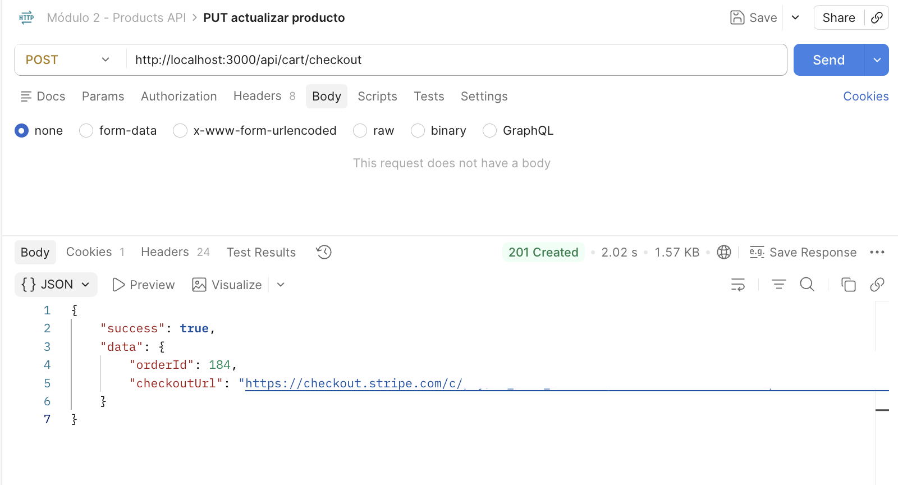
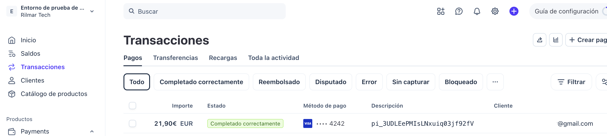
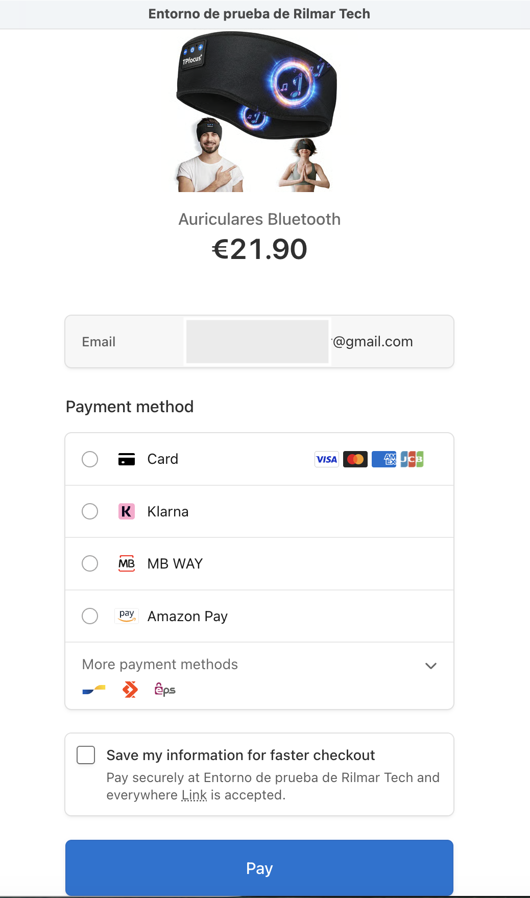

# Rilmar Tech — Backend API

Backend de **Rilmar Tech**, una aplicación full-stack de comercio electrónico orientada a productos tecnológicos.

La API gestiona autenticación, usuarios, catálogo, carrito, wishlist, reseñas, checkout con Stripe, pedidos, administración, emails transaccionales y persistencia híbrida mediante PostgreSQL y MongoDB.

---

## Tecnologías

### Backend

- Node.js
- Express 5
- JavaScript ES Modules
- Prisma ORM
- PostgreSQL
- MongoDB Atlas
- Mongoose

### Autenticación y seguridad

- JSON Web Tokens
- Cookies HTTP-Only
- bcrypt
- Helmet
- CORS con credenciales
- express-rate-limit
- Invalidación de sesiones mediante `authVersion`
- Tokens de recuperación de contraseña almacenados mediante hash SHA-256
- Row Level Security para datos expuestos mediante PostgreSQL/Supabase

### Servicios externos

- Stripe — checkout y pagos
- Cloudinary — almacenamiento de imágenes
- Resend — emails transaccionales

### Testing y documentación

- Jest
- Supertest
- Swagger / OpenAPI

---

# Arquitectura

El backend sigue una arquitectura modular basada principalmente en:

```text
src/
├── controllers/
├── middleware/
├── routes/
├── services/
├── utils/
└── server.js

prisma/
├── migrations/
└── schema.prisma

tests/
```

La aplicación separa responsabilidades entre:

```text
HTTP Request
     │
     ▼
   Route
     │
     ▼
Middleware
     │
     ▼
Controller
     │
     ▼
 Service
     │
     ▼
Database / External service
```

Los controladores gestionan la capa HTTP mientras que la lógica de negocio se concentra en los servicios.

---

# Persistencia híbrida

Rilmar Tech utiliza dos sistemas de persistencia en función del tipo de información.

## PostgreSQL + Prisma

Se utiliza para los datos relacionales y transaccionales:

- Usuarios
- Productos
- Carritos
- Items del carrito
- Pedidos
- Items de pedidos
- Stock
- Estados comerciales
- Alertas de reposición

## MongoDB Atlas + Mongoose

Se utiliza para dominios documentales:

- Wishlist
- Reviews

Esta separación permite mantener en PostgreSQL la integridad necesaria para operaciones comerciales y utilizar MongoDB para información con una estructura más documental.

---

# Autenticación

La API utiliza autenticación mediante JWT almacenado en una cookie **HTTP-Only**.

El token no se devuelve al frontend dentro del JSON ni se almacena en `localStorage`.

La duración del JWT se configura mediante:

```env
JWT_EXPIRES_IN=7d
```

Flujo principal:

```text
Registro / Login
       │
       ▼
Credenciales validadas
       │
       ▼
JWT firmado
       │
       ▼
Cookie HTTP-Only
       │
       ▼
Middleware de autenticación
```

La aplicación soporta dos roles:

```text
USER
ADMIN
```

Las operaciones administrativas se protegen también en backend, por lo que la seguridad no depende únicamente de ocultar las rutas en el frontend.

---

# Política de contraseñas

Las contraseñas deben cumplir una política mínima de seguridad tanto durante el registro como durante los flujos en los que se establece una nueva contraseña.

Requisitos:

- Mínimo 8 caracteres
- Al menos una letra minúscula
- Al menos una letra mayúscula
- Al menos un número
- Al menos un carácter especial

Las contraseñas se almacenan mediante **bcrypt** y nunca se persisten en texto plano.

---

# Recuperación de contraseña

El flujo de recuperación está diseñado para evitar enumeración de usuarios.

Ante una solicitud de recuperación, la API devuelve la misma respuesta exista o no una cuenta asociada al correo.

Si el usuario existe:

1. Se genera un token criptográficamente aleatorio.
2. El token original se incluye únicamente en el enlace enviado por email.
3. En PostgreSQL se almacena únicamente su hash SHA-256.
4. El token expira después de 15 minutos.
5. Una nueva solicitud invalida el token anterior.

El token es de un solo uso.

Cuando la contraseña se restablece correctamente también se incrementa:

```text
authVersion
```

Los JWT generados con una versión anterior dejan de ser aceptados, invalidando así sesiones previas.

El restablecimiento de contraseña no inicia automáticamente una nueva sesión.

---

# Rate limiting

Los endpoints sensibles de autenticación utilizan límites específicos.

| Operación | Límite |
|---|---:|
| Login | 10 intentos / 15 min |
| Registro | 10 intentos / hora |
| Forgot password | 5 solicitudes / 15 min |
| Reset password | 10 intentos / 15 min |

Durante el entorno de testing estos límites se omiten para evitar interferencias entre pruebas automatizadas.

---

# Productos

La API ofrece catálogo público y administración de productos.

## Catálogo público

Permite:

- Consultar productos activos
- Buscar por texto
- Filtrar por categoría
- Filtrar por precio
- Filtrar por disponibilidad
- Ordenar resultados
- Paginar resultados
- Obtener el detalle de un producto

La búsqueda de productos soporta texto **insensible a acentos**, utilizando la extensión `unaccent` de PostgreSQL.

Ejemplo conceptual:

```text
lampara
```

puede encontrar resultados que contengan:

```text
Lámpara Inteligente
```

sin requerir que el usuario escriba exactamente los mismos acentos.

---

# Administración de productos

Los usuarios con rol `ADMIN` pueden:

- Crear productos
- Editar productos
- Desactivar productos
- Restaurar productos
- Gestionar stock
- Gestionar varias imágenes
- Buscar productos
- Filtrar por categoría
- Filtrar por estado
- Filtrar por disponibilidad

La eliminación de productos es lógica:

```text
isActive = false
```

De esta forma se evita destruir información que pueda estar relacionada con pedidos históricos.

---

# Imágenes

Los productos admiten múltiples imágenes.

```text
images: String[]
```

Los uploads se gestionan mediante Multer y Cloudinary.

Esto evita almacenar archivos arbitrarios directamente en el servidor de la aplicación.

---

# Carrito

Los usuarios autenticados disponen de un carrito persistente almacenado en PostgreSQL.

La base de datos garantiza:

- Un único carrito `ACTIVE` por usuario
- Un único item por producto dentro de cada carrito
- Persistencia entre sesiones
- Actualización de cantidades
- Eliminación de productos
- Integridad del carrito

El frontend incorpora además un carrito de invitado que posteriormente puede sincronizarse con el carrito persistente tras iniciar sesión o registrarse.

La sincronización definitiva se realiza contra esta API.

Los datos comerciales relevantes, como precio, disponibilidad y stock, se validan siempre en backend y no se confían al contenido almacenado por el cliente.

---

# Checkout y Stripe

El proyecto integra un flujo real de pago mediante **Stripe Checkout**.

La sesión de Stripe se crea exclusivamente desde el backend.

El servidor controla:

- Usuario autenticado
- Productos
- Cantidades
- Precios
- Stock
- Total
- Moneda
- Pedido asociado
- Metadata de Stripe
- URLs de retorno

El frontend no construye el pago ni determina los importes. Solicita el checkout al backend y recibe la URL necesaria para redirigir al usuario a Stripe.

Flujo simplificado:

```text
Carrito
   │
   ▼
POST checkout
   │
   ▼
Validación de productos y stock
   │
   ▼
Transacción PostgreSQL
   │
   ▼
Reserva de stock
   │
   ▼
Pedido PENDING
   │
   ▼
Stripe Checkout Session
   │
   ▼
Página segura de Stripe
   │
   ▼
Pago
   │
   ▼
Webhook firmado de Stripe
   │
   ▼
Pedido PAID
```

Ejemplo de respuesta:

```json
{
  "success": true,
  "data": {
    "orderId": 184,
    "checkoutUrl": "https://checkout.stripe.com/..."
  }
}
```

El frontend no procesa directamente los datos sensibles de la tarjeta.

La información de pago es gestionada por Stripe.

## Confirmación del pago

La página de éxito del frontend **no marca un pedido como pagado**.

Stripe notifica el resultado al backend mediante un webhook firmado, que actúa como fuente de verdad para el estado del pago.

Una sesión completada puede producir:

```text
PENDING → PAID
```

El stock ya fue reservado durante la creación del pedido, por lo que **no vuelve a descontarse al confirmar el pago**.

Una sesión expirada puede producir:

```text
PENDING → CANCELLED
```

restaurando el stock reservado cuando corresponde.

El procesamiento utiliza transiciones de estado para evitar aplicar varias veces los efectos de un mismo evento.

## Idempotencia y compensación

La creación de sesiones de Stripe utiliza una clave de idempotencia asociada al pedido.

Si la creación de la sesión falla antes de poder completar correctamente el checkout, el backend dispone de lógica de compensación para mantener coherentes el pedido, el carrito y el stock.

Si una sesión de Stripe ya ha sido creada pero se produce un fallo posterior al persistir su asociación local, el backend intenta expirar primero la sesión remota antes de compensar el estado local.

Si no puede confirmarse de forma segura la expiración remota, se conserva el estado local de forma conservadora en lugar de liberar stock que pudiera estar asociado a una sesión de pago todavía válida.

---

# Integridad de stock

La lógica comercial protege el stock frente a compras concurrentes.

Durante el checkout:

1. Se obtiene el carrito activo.
2. Se valida que contenga productos.
3. Se comprueba la disponibilidad.
4. Se realizan actualizaciones condicionales de stock.
5. Se calcula el total.
6. Se crea el pedido.
7. Se almacenan snapshots comerciales.
8. Se completa el flujo del carrito.

Las operaciones críticas se ejecutan dentro de transacciones Prisma.

Si una operación falla:

```text
ROLLBACK
```

Esto evita estados parciales dentro de la transacción.

La actualización condicional de inventario evita además que dos checkouts concurrentes puedan comprar correctamente la misma última unidad.

La integración con Stripe incorpora mecanismos adicionales de compensación para reducir el riesgo de inconsistencias entre el proveedor de pagos y el estado local.

---

# Importes monetarios

Los importes monetarios utilizan:

```text
Prisma.Decimal
```

en lugar de tipos de coma flotante.

Esto evita errores de precisión en cálculos comerciales.

Los importes se conservan con dos decimales.

---

# Pedidos

Los pedidos se almacenan en PostgreSQL.

Estados comerciales soportados:

```text
PENDING
PAID
CANCELLED
REFUNDED
```

Cada pedido conserva información histórica de la compra.

Cada item almacena, entre otros datos:

- Producto
- Nombre en el momento de la compra
- Imagen
- Cantidad
- Precio aplicado
- Referencia al producto original cuando corresponde

De esta manera, modificar posteriormente un producto no altera la información histórica de compras anteriores.

---

# Historial de pedidos

Los usuarios autenticados pueden consultar sus pedidos desde su perfil.

El backend dispone de endpoints autenticados destinados a recuperar el historial del usuario.

Esto permite mostrar:

- Número de pedido
- Fecha
- Estado
- Total
- Productos
- Cantidades
- Precio histórico

La consulta del detalle de un pedido está limitada al usuario propietario del mismo.

---

# Administración de pedidos

Los administradores disponen de endpoints específicos para consultar los pedidos de la tienda.

La API permite utilizar esta información para:

- Listar pedidos
- Consultar pedidos
- Buscar por datos relevantes
- Filtrar por estado
- Visualizar cliente
- Visualizar fecha
- Visualizar total

La autorización se realiza mediante el rol `ADMIN`.

---

# Administración de usuarios

El backend expone endpoints administrativos para consultar usuarios registrados.

La administración puede utilizar esta información para:

- Listar usuarios
- Buscar por nombre o email
- Filtrar por rol
- Consultar información asociada
- Diferenciar usuarios y administradores

Los datos sensibles, como hashes de contraseñas, no se exponen en las respuestas administrativas.

---

# Wishlist

La lista de deseos se almacena mediante MongoDB Atlas y está vinculada al usuario autenticado.

Permite:

```http
GET /api/wishlist
```

y operaciones de toggle mediante el identificador de producto.

La wishlist persiste entre sesiones y no depende del almacenamiento local del navegador.

---

# Reviews

Las reseñas se almacenan mediante MongoDB Atlas y Mongoose.

El sistema permite consultar las reseñas asociadas a cada producto y publicar nuevas reseñas desde una sesión autenticada.

Esta información documental se mantiene separada de las operaciones transaccionales de PostgreSQL.

---

# Alertas de reposición

Los usuarios autenticados pueden solicitar recibir una notificación cuando un producto agotado vuelva a tener stock.

Estados:

```text
PENDING
NOTIFIED
CANCELLED
```

Cuando el stock cambia desde:

```text
0 → valor positivo
```

se procesan las alertas pendientes.

Si Resend confirma el envío:

```text
PENDING → NOTIFIED
```

Si el proveedor de email falla:

- El cambio de stock no se revierte
- La alerta continúa pendiente
- El resto del procesamiento puede continuar

Un aumento posterior sobre un producto que ya tenía stock no genera una notificación duplicada.

## Row Level Security

La tabla PostgreSQL `RestockAlert` tiene **Row Level Security (RLS)** habilitado.

Esto impide que la exposición de la tabla mediante una capa de acceso directo conceda por defecto acceso público a sus filas.

La aplicación realiza las operaciones autorizadas desde el backend mediante su conexión de base de datos.

---

# Emails transaccionales

La API integra Resend para emails relacionados con:

- Registro y bienvenida
- Recuperación de contraseña
- Alertas de reposición

Los fallos de servicios externos se gestionan para no romper operaciones de negocio que ya hayan sido completadas correctamente cuando corresponde.

El contenido dinámico insertado en HTML se escapa antes de construir los emails.

---

# Manejo de errores

La aplicación utiliza un sistema centralizado de errores basado en componentes como:

```text
AppError
ErrorSelector
errorHandler
```

Las respuestas mantienen una estructura consistente.

Ejemplo:

```json
{
  "success": false,
  "error": {
    "code": "UNAUTHORIZED",
    "message": "Unauthorized"
  }
}
```

Los errores inesperados no deben exponer información interna sensible en producción.

---

# Endpoints principales

La mayor parte de la API se monta bajo:

```text
/api
```

y dispone además de:

```http
GET /health
```

para comprobar el estado del servicio.

Los principales dominios son:

```text
/api/auth
/api/products
/api/products/:productId/reviews
/api/users
/api/wishlist
/api/cart
/api/orders
/api/payments
```

Entre las operaciones disponibles se encuentran:

- Registro
- Login
- Logout
- Recuperación de contraseña
- Catálogo
- Administración de productos
- Reviews
- Wishlist
- Carrito
- Checkout
- Historial de pedidos
- Administración de pedidos
- Administración de usuarios
- Consulta autenticada del estado de checkout
- Webhook de Stripe

El webhook de Stripe recibe el cuerpo original de la petición para permitir la verificación de su firma antes del procesamiento JSON convencional de la aplicación.

---

# Seguridad

Entre las principales decisiones de seguridad del proyecto se encuentran:

### JWT fuera de JavaScript

El JWT se almacena en una cookie HTTP-Only y no en `localStorage`.

### Password hashing

Las contraseñas se almacenan utilizando bcrypt.

### Política de contraseñas

Las nuevas contraseñas deben cumplir los requisitos mínimos definidos por la aplicación.

### Recuperación de contraseña segura

Los tokens reales de recuperación nunca se almacenan directamente en la base de datos.

### Anti-enumeración

El endpoint de recuperación no revela si un correo pertenece a una cuenta registrada.

### Tokens temporales

Los tokens de recuperación expiran y solo pueden utilizarse una vez.

### Invalidación de sesiones

`authVersion` permite invalidar sesiones previas después de un cambio de contraseña.

### Rate limiting

Los endpoints sensibles cuentan con protección frente a intentos repetidos.

### Autorización server-side

El backend comprueba los roles independientemente de la interfaz del frontend.

### Propiedad de recursos

Las consultas de recursos privados, como el detalle de pedidos, comprueban también el usuario propietario.

### Integridad de stock

Se utilizan transacciones y operaciones condicionales para reducir el riesgo de overselling.

### Importes monetarios

Los precios se procesan mediante tipos decimales y los importes del checkout se determinan en backend.

### Servicios de pago

Los datos sensibles de las tarjetas se gestionan directamente mediante Stripe.

El cliente no es la fuente de verdad para precios, stock ni estado de pago.

### Webhooks

La confirmación del pago se procesa mediante webhooks cuya firma se verifica utilizando el secreto configurado para el endpoint.

### Row Level Security

`RestockAlert` tiene RLS habilitado en PostgreSQL.

### Uploads

Las imágenes se almacenan mediante Cloudinary.

### Secretos

Las credenciales y claves privadas se configuran mediante variables de entorno y no deben incluirse en el repositorio.

---

# Testing

El proyecto utiliza:

```text
Jest
Supertest
```

Ejecutar la suite:

```bash
npm test
```

Los tests se ejecutan secuencialmente mediante `--runInBand`.

La cobertura funcional incluye, entre otras áreas:

- Registro
- Login
- Logout
- Cookies HTTP-Only
- Roles y autorización
- Política de contraseñas
- Recuperación de contraseña
- Invalidación de sesiones
- Productos
- Catálogo
- Carrito
- Wishlist
- Reviews
- Checkout
- Stripe
- Webhooks
- Stock
- Concurrencia
- Pedidos
- Emails
- Alertas de reposición
- Manejo de errores

La suite actual del proyecto finaliza correctamente con:

```text
Test Suites: 16 passed, 16 total
Tests:       98 passed, 98 total
```

---

# Evidencias del proyecto

Las siguientes capturas muestran algunos de los principales flujos e integraciones del backend.

## API documentada con Swagger

Vista de la API desplegada y documentada mediante Swagger / OpenAPI.


## Autenticación

Login realizado contra la API con respuesta satisfactoria.


## Persistencia documental

Reviews almacenadas en MongoDB Atlas mediante Mongoose.


## Creación del checkout

El backend valida la operación, crea el pedido y devuelve la URL de la sesión de Stripe Checkout.



## Stripe Checkout

Sesión de pago generada por el backend y procesada en la página segura de Stripe.



## Pago completado

Transacción de prueba completada correctamente y registrada en Stripe.



## Despliegue

Backend desplegado como servicio web.


---

# Ejecución local

## 1. Clonar el repositorio

```bash
git clone https://github.com/J-Mateo/modulo2.git
cd modulo2
```

## 2. Instalar dependencias

```bash
npm install
```

## 3. Configurar variables de entorno

El repositorio incluye:

```text
.env.example
```

Crea un archivo `.env` a partir de ese ejemplo y configura las credenciales y URLs necesarias para los servicios utilizados por la aplicación.

Nunca deben subirse credenciales reales al repositorio.

Entre las variables utilizadas se encuentran:

```text
NODE_ENV
DATABASE_URL
DIRECT_URL
MONGO_URI
JWT_SECRET
JWT_EXPIRES_IN
PORT
FRONTEND_URL
CLOUDINARY_CLOUD_NAME
CLOUDINARY_API_KEY
CLOUDINARY_API_SECRET
RESEND_API_KEY
EMAIL_FROM
STRIPE_SECRET_KEY
STRIPE_WEBHOOK_SECRET
```

El valor utilizado actualmente como referencia para la duración del JWT es:

```env
JWT_EXPIRES_IN=7d
```

Las claves y credenciales del archivo `.env.example` son únicamente placeholders y deben sustituirse localmente.

## 4. Base de datos

Aplicar las migraciones Prisma correspondientes antes de iniciar la aplicación.

## 5. Desarrollo

```bash
npm run dev
```

El servidor se inicia mediante:

```text
node --watch src/server.js
```

## 6. Producción

```bash
npm start
```

---

# Scripts

| Comando | Descripción |
|---|---|
| `npm run dev` | Inicia el servidor en modo desarrollo |
| `npm start` | Inicia el servidor |
| `npm test` | Ejecuta Jest y Supertest |

---

# CORS

La aplicación utiliza CORS con credenciales.

El origen del frontend debe configurarse mediante:

```env
FRONTEND_URL=http://localhost:5173
```

En desarrollo normalmente apunta al servidor de Vite.

En producción debe sustituirse por la URL real del frontend desplegado.

La configuración final de producción debe mantener coherencia entre CORS, cookies y HTTPS para que la autenticación basada en credenciales funcione correctamente entre frontend y backend.

---

# Despliegue

Frontend y backend se despliegan de forma independiente.

La configuración de producción requiere:

- URL pública del backend
- URL pública del frontend
- PostgreSQL accesible desde el backend
- MongoDB Atlas
- Cloudinary
- Resend
- Stripe
- CORS configurado para el frontend real
- Cookies compatibles con HTTPS y el entorno de producción
- Endpoint de webhook de Stripe apuntando al backend desplegado

El endpoint de Stripe en producción debe configurarse en Stripe para enviar los eventos al backend, utilizando una URL con esta estructura:

```text
https://TU-BACKEND/api/payments/webhook
```

El secreto correspondiente al webhook de producción debe configurarse mediante `STRIPE_WEBHOOK_SECRET`.

Las URLs públicas definitivas se incorporarán a esta documentación una vez completado y validado el despliegue.

---

# Frontend

El frontend de Rilmar Tech se desarrolla en un repositorio independiente:

**Rilmar Tech Frontend**

https://github.com/J-Mateo/rilmar-tech-frontend

Está construido con React, Vite, Redux Toolkit y React Router.

Frontend y backend constituyen conjuntamente la aplicación full-stack Rilmar Tech.

---

# Funcionalidades implementadas

- ✅ Registro
- ✅ Login
- ✅ Logout
- ✅ JWT mediante cookie HTTP-Only
- ✅ Persistencia de sesión
- ✅ Roles `USER` y `ADMIN`
- ✅ Perfil autenticado
- ✅ Política fuerte de contraseñas
- ✅ Recuperación de contraseña
- ✅ Tokens seguros y de un solo uso
- ✅ Invalidación de sesiones anteriores
- ✅ Rate limiting
- ✅ Catálogo público
- ✅ Búsqueda insensible a acentos
- ✅ Filtros
- ✅ Ordenación
- ✅ Paginación
- ✅ CRUD administrativo de productos
- ✅ Múltiples imágenes
- ✅ Cloudinary
- ✅ Carrito persistente
- ✅ Sincronización con carrito de invitado
- ✅ Wishlist persistente
- ✅ Reviews
- ✅ Checkout
- ✅ Stripe Checkout
- ✅ Webhooks de Stripe
- ✅ Integridad transaccional
- ✅ Control de stock
- ✅ Protección frente a overselling
- ✅ Pedidos
- ✅ Historial de pedidos
- ✅ Administración de pedidos
- ✅ Administración de usuarios
- ✅ Snapshots comerciales
- ✅ Importes mediante Decimal
- ✅ Alertas de reposición
- ✅ Emails transaccionales
- ✅ PostgreSQL
- ✅ Prisma
- ✅ MongoDB Atlas
- ✅ Mongoose
- ✅ Row Level Security en `RestockAlert`
- ✅ Swagger / OpenAPI
- ✅ Jest
- ✅ Supertest
- ✅ Integración completa con frontend React

---

# Repositorios

### Backend

https://github.com/J-Mateo/modulo2

### Frontend

https://github.com/J-Mateo/rilmar-tech-frontend

---

# Autora

**Jessica Mateo**

Proyecto desarrollado individualmente como aplicación full-stack de comercio electrónico.

El proyecto pone especial atención en:

- Arquitectura modular
- Seguridad de autenticación
- Separación de responsabilidades
- Integridad transaccional
- Control de concurrencia
- Persistencia híbrida PostgreSQL / MongoDB
- Integración con servicios externos
- Experiencia de compra completa
- Testing automatizado